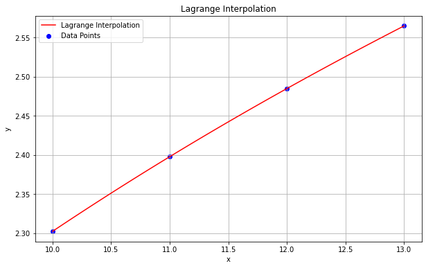
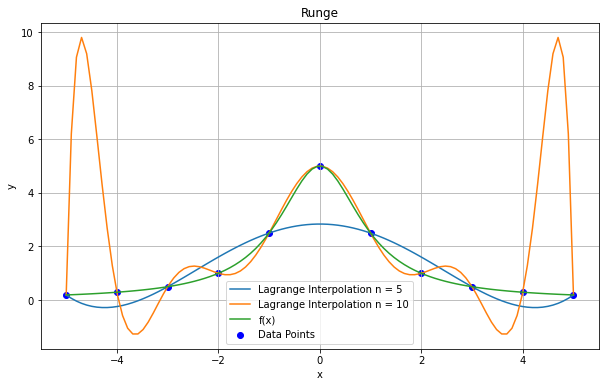

```python
#coding=utf-8

'''
由给定的关于变量x与y对应的一组数据，且插值节点两两互异，数据以两个列表x_list与y_list
的形式提供，编写函数实现Lagrange插值法（不应调用python三方库中已实现的多项式插值计算
函数），求插值多项式在插值点x的值。
'''
import numpy as np
import matplotlib.pyplot as plt

#编写下述Lagrange插值函数

def Lagrange_poly(x_list,y_list,x):
    
#任务一：请在此处添加代码完成该函数，实现Lagrange插值计算功能

######Begin_1######

    l_list = []
    for i, x_i in enumerate(x_list):
        term = 1
        for j, x_j in enumerate(x_list):
            if i != j:
                term *= (x - x_j) / (x_i - x_j)
        l_list.append(term)
    P = lambda x: sum(y * l for y, l in zip(y_list, l_list))
    return P(x)

######End_1######

#任务二：依据下述数据表，调用Lagrange_poly函数，利用插值多项式计算x=11.75的近似值，
#并打印输出，另画图显示插值多项式曲线与各插值节点
'''
x   10       11       12       13
y   2.3026   2.3979   2.4849   2.5649

'''
######Begin_2######

x_list = [10, 11, 12, 13]
y_list = [2.3026, 2.3979, 2.4849, 2.5649]
answer = Lagrange_poly(x_list, y_list, x=11.75)

# 打印x=11.75的近似值
print(f"The approximate value at x=11.75 is: {answer}")

# 绘制插值多项式曲线与各插值节点
x_vals = list(np.linspace(10, 13, 100))  # x值的范围
y_vals = [Lagrange_poly(x_list, y_list, x) for x in x_vals]  # 计算对应的y值
plt.figure(figsize=(10, 6))
plt.plot(x_vals, y_vals, 'r-', label='Lagrange Interpolation')  # 插值多项式曲线
plt.scatter(x_list, y_list, color='b', label='Data Points')  # 插值节点
plt.title('Lagrange Interpolation')
plt.xlabel('x')
plt.ylabel('y')
plt.legend()
plt.grid(True)
plt.show()

######End_2######

#任务三：对于被插值函数f(x)=5/(1+x^2),取不同的节点数n=5,10，在区间[-5,5]取n等分节点作为
#插值节点，将f(x)与插值多项式曲线画在同一张图上直观比较，分析Runge现象。
######Begin_3######

# n = 5
ns = [5, 10]
plt.figure(figsize=(10, 6))
for n in ns: 
    f = lambda x: 5 / (1 + x ** 2)
    x_list = [-5 + 10 / n * i for i in range(n+1)]
    y_list = [f(x) for x in x_list]

    x_vals = list(np.linspace(-5, 5, 100))  # x值的范围
    y_vals = [Lagrange_poly(x_list, y_list, x) for x in x_vals]  # 计算对应的y值

    plt.plot(x_vals, y_vals, label=f'Lagrange Interpolation n = {n}')  # 插值多项式曲线
    
plt.scatter(x_list, y_list, color='b', label='Data Points')  # 插值节点    
plt.plot(x_vals, [f(x) for x in x_vals], label = 'f(x)')
plt.grid(True)
plt.title('Runge')
plt.xlabel('x')
plt.ylabel('y')
plt.legend()
plt.show()

######End_3######
```
The approximate value at x=11.75 is: 2.4638570312500003


