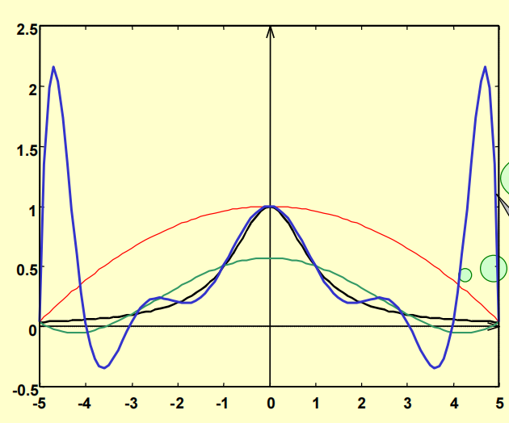

# 插值算法（二）

## Newton插值

根据上一节的知识，我们发现，Lagrange插值多项式虽然容易计算，但是在增加一个插值点的时候，所有的插值基函数都要进行修正，也就是不具有**承袭性**。为此，我们这里介绍一种具有承袭性的插值算法——Newton插值法。

### 定义

定义Newton插值的一般形式为$N_n(x) = C_0 + C_1(x-x_0) + C_2(x-x_0)(x-x_1)+\dots+C_n(x-x_0)(x-x_1)\dots(x-x_n)$，其中，这$n+1$个多项式称为Newton插值以 \( x_0, x_1, \ldots, x_n \) 为节点的基函数。
\[ N_n(x) = C_0 \Phi_0(x) + C_1 \Phi_1(x) + \ldots + C_n \Phi_n(x) \]

### 系数计算

\[ N_n(x) = C_0 + C_1(x-x_0) + C_2(x-x_0)(x-x_1) + \cdots + C_n(x-x_0)(x-x_1)\cdots(x-x_{n-1}) \]

已知基函数，求 \( N_n(x) \Rightarrow \) 求系数 \( C_0, C_1, C_2, \ldots, C_n \)

\[ N_n(x_i) = f(x_i) \quad i = 0, 1, 2, \ldots, n \]

在公式中，取 \( x = x_0 \) 有： \( N_n(x_0) = C_0 \) 而 \( N_n(x_0) = f(x_0) \)  
\[ \therefore C_0 = f(x_0) \]

在公式中，取 \( x = x_1 \) 有： \( N_n(x_1) = C_0 + C_1(x_1-x_0) \)，而 \( N_n(x_1) = f(x_1) \)  
\[ \therefore C_1 = \frac{f(x_1) - f(x_0)}{x_1 - x_0} \]

同理，有：  
\[ C_2 = \left[ \frac{f(x_2) - f(x_1)}{x_2 - x_1} - \frac{f(x_1) - f(x_0)}{x_1 - x_0} \right] / (x_2 - x_0) \]

为了易于计算 \( C_0, C_1, C_2, \ldots, C_n \) 引进差商。

### 差商

设函数 \( f(x) \) 在 \( n+1 \) 个相异节点 \( x_0, x_1, \ldots, x_n \) 上的函数值分别为 \( f(x_0), f(x_1), \ldots, f(x_n) \)。

1. 一阶差商：称 \( \frac{f(x_0) - f(x_1)}{x_0 - x_1} \) 为 \( f(x) \) 关于节点 \( x_0, x_1 \) 的一阶差商，记为 \( f[x_0, x_1] \)。
2. 二阶差商：  
\[ \frac{f[x_0, x_1] - f[x_1, x_2]}{x_0 - x_2} = f[x_0, x_1, x_2] \]  称为 \( f(x) \) 关于节点 \( x_0, x_1, x_2 \) 的二阶差商。
3. \( k \) 阶差商：  
\( f(x) \) 在互异节点 \( x_0, x_1, \ldots, x_k \) 处的 \( k \) 阶差商为  
\[ f[x_0, x_1, \ldots, x_{k-1}, x_k] = \frac{f[x_0, x_1, \ldots, x_{k-1}] - f[x_1, \ldots, x_{k-1}, x_k]}{x_0 - x_k} \]  一般记忆为：  
\[ f[A, B, C] = \frac{f[A, B] - f[B, C]}{A - C} \]

#### 差商的性质

1. \( n \) 阶差商可以表示成 \( n+1 \) 个函数值的线性组合，即  
\[ f[x_0, x_1, \ldots, x_n] = \sum_{k=0}^{n} \frac{f(x_k)}{(x_k - x_0) \cdots (x_k - x_{k-1})(x_k - x_{k+1}) \cdots (x_k - x_n)} \]
以二阶差商为例子：  
\[ f[x_0, x_1, x_2] = \left[ \frac{f(x_2) - f(x_1)}{x_2 - x_1} - \frac{f(x_1) - f(x_0)}{x_1 - x_0} \right] / (x_2 - x_0)\]  \[= \frac{f(x_0)}{(x_0 - x_1)(x_0 - x_2)} + \frac{f(x_1)}{(x_1 - x_0)(x_1 - x_2)} + \frac{f(x_2)}{(x_2 - x_0)(x_2 - x_1)} \]
**归纳法**：$n=1$时结论显然成立；假设$n = k$时结论成立，需要证明对于 \( n = k+1 \) 时，结论也成立。即 \( (k+1) \) 阶差商可以表示为：
   \[
   f[x_0, x_1, \ldots, x_{k+1}] = \sum_{i=0}^{k+1} \frac{f(x_i)}{\prod_{\substack{0 \leq j \leq k+1 \\ j \neq i}} (x_i - x_j)}
   \]

   根据 \( (k+1) \) 阶差商的定义：
   \[
   f[x_0, x_1, \ldots, x_{k+1}] = \frac{f[x_0, x_1, \ldots, x_k] - f[x_1, x_2, \ldots, x_{k+1}]}{x_0 - x_{k+1}}
   \]

   根据归纳假设，我们可以将 \( f[x_0, x_1, \ldots, x_k] \) 和 \( f[x_1, x_2, \ldots, x_{k+1}] \) 代入上述公式，然后进行化简。化简过程中，每个项都会包含 \( f(x_i) \) 形式的函数值，并且分母是所有 \( x_j \) （\( j \neq i \)）的差的乘积。

2. （对称性）：差商与节点的顺序无关，例  
\[ f[x_0, x_1, x_2] = f[x_1, x_0, x_2] = \cdots = f[x_0, x_2, x_1] \]这个性质只需要计算负号个数非常容易证明。
3. 若 \( f(x) \) 是 \( x \) 的 \( n \) 次多项式，则一阶差商 \( f[x, x_0] \) 是 \( x \) 的 \( n-1 \) 次多项式，二阶差商 \( f[x, x_0, x_1] \) 是 \( x \) 的 \( n-2 \) 次多项式；  一般，函数 \( f(x) \) 的 \( k \) 阶差商 \( f[x, x_0, \ldots, x_{k-1}] \) 是 \( x \) 的 \( n-k \) (\( k \leq n \)) 次多项式，而 \( k > n \) 时，\( k \) 阶差商为零
**证明**：
当 \( n = 1 \) 时，一阶差商 \( f[x, x_1] \) 是 
\[ f[x, x_1] = \frac{f(x) - f(x_0)}{x - x_0} \]，显然多项式分子$f(x) - f(x_0)$存在一个根$x_0$，因此可以约掉分母，成为一个$n-1$次多项式。假设对于 \( n = k \) 时，结论成立，即 \( k \) 阶差商 \( f[x, x_0, x_1, \ldots, x_{k-1}] \) 是 \( n-k \) 次多项式。
我们需要证明对于 \( n = k+1 \) 时，结论也成立。即 \( (k+1) \) 阶差商 \( f[x, x_1, \ldots, x_k] \) 是 \( n-(k+1) \) 次多项式。根据 \( (k+1) \) 阶差商的定义：
\[ f[x, x_0, \ldots, x_k] = \frac{f[x, x_0, \ldots, x_{k-1}] - f[x_0, x_1, x_2, \ldots, x_k]}{x - x_k} \]。根据归纳假设，\( f[x_0, x_1, \ldots, x_k] \) 是 \( n-k \) 次多项式，\( f[x_1, x_2, \ldots, x_{k+1}] \) 是 \( n-(k+1) \) 次多项式。两者相减，最高次项的系数相减，结果仍然是 \( n-k \) 次多项式。再除以 \( x_0 - x_{k+1} \)（一个常数），结果是一个 \( n-(k+1) \) 次多项式。

### 牛顿插值的余项

\[ N_n(x) = c_0 + c_1(x-x_0) + c_2(x-x_0)(x-x_1) + \ldots + c_n(x-x_0)\ldots(x-x_{n-1}) \]

\[
\begin{cases}
f(x) = f(x_0) + (x-x_0)f[x, x_0] & \text{...............①} \\
f[x, x_0] = f[x_0, x_1] + (x-x_1)f[x, x_0, x_1] & \text{...............②} \\
\ldots \ldots \\
f[x, x_0, \ldots, x_{n-1}] = f[x_0, \ldots, x_n] + (x-x_n)f[x, x_0, \ldots, x_n] & \text{...............⑩}
\end{cases}
\]

\[
\text{①} + (x-x_0) \times \text{②} + \ldots + (x-x_0)\ldots(x-x_{n-1}) \times \text{⑩}
\]

\[
\Rightarrow f(x) = f(x_0) + f[x_0, x_1](x-x_0) + \ldots + f[x, x_0, \ldots, x_n](x-x_0)\ldots(x-x_{n-1})
\]

\[
c_i = f[x_0, \ldots, x_i]
\]

\[
f(x) = N_n(x) + f[x, x_0, \ldots, x_n](x-x_0)\ldots(x-x_{n-1})
\]
即得到$R_n(x) = f[x, x_0, \ldots, x_n](x-x_0)\ldots(x-x_{n-1})$

### $N_n(x)$与$P_n(x)$的关系

1. 在给定节点 \( x_0, x_1, \ldots, x_n \) 上的Newton插值公式 \( N_n(x) \) 与Lagrange插值公式 \( P_n(x) \) 都满足插值条件：
   \[
   N_n(x_i) = P_n(x_i) = f(x_i) \quad i = 0, 1, 2, \ldots, n
   \]
   由插值多项式的唯一性，我们有：
   \[
   P_n(x) = N_n(x)
   \]

2. 由1知 \( P_n(x) \) 与 \( N_n(x) \) 有相同的余项：
   \[
   R_n(x) = f(x) - P_n(x) = \frac{f^{(n+1)}(\xi)}{(n+1)!} \omega(x)
   \]\[
   = f(x) - N_n(x) = f[x, x_0, \ldots, x_n] \omega(x)
   \]

**定理**：
在节点 \( x_0, x_1, \ldots, x_n \) 所界定的范围 \( \Phi: [\min x_i, \max x_i] \) 内存在一点 \( \xi \)，使得：
\[
f[x_0, x_1, \ldots, x_n] = \frac{f^{(n)}(\xi)}{n!}
\]

## 分段低次插值

对于 \( y = f(x) \)  
\( a \leq x \leq b \)

给定插值结点 \( x_0, x_1, \ldots, x_n \)，构造插值多项式 \( P_n(x) \)，为使 \( P_n(x) \) 更好地逼近 \( f(x) \)，一般使：

节点间距较小 => 节点多 (n较大) => 插值多项式 \( P_n(x) \) 的次数很高  
(高次插值)

高次插值使 \( P_n(x) \) 在较多点上与 \( f(x) \) 相等，但在插值节点外，误差如何？

是否插值多项式 \( P_n(x) \) 的次数越高越好？

在 \([-5, 5]\) 上考察 \( f(x) = \frac{1}{1 + x^2} \) 的 \( P_n(x) \)。取 \( x_i = -5 + \frac{10}{n} i \) \( (i = 0, \ldots, n) \)

发现$n$越大，在端点附近的抖动越大。这就导致在插值点比较稀疏的地方预测非常不准确。于是我们引入分段低次插值的思想。

### 核心思想

将一个区间分成若干小区间，在每个小区间上进行低次插值，将产生的多项式装配成整个大区间上的分段k次式。其步骤为：

1. 对 \([a, b]\) 作分划 \(\Phi: a = x_0 < x_1 < \ldots < x_n = b\)
2. 在每个小区间 \([x_i, x_{i+1}]\) 上构造低次插值多项式 \(P_i(x)\)
3. 将 \(P_i(x), i = 0, 1, \ldots, n-1\) 拼接为 \([a, b]\) 上的分段多项式 \(g(x)\) 作为 \(f(x)\) 的插值函数，即 \(g(x) = P_i(x)\) \(x \in [x_i, x_{i+1}]\)

一般 \(P_i(x)\) 都为k次式，此时的 \(g(x)\) 记为 \(S_k(x)\)，称其为分段k次式。  
（即在分划 \(\Phi\) 的每个小区间 \([x_i, x_{i+1}]\) 上 \(S_k(x)\) 都为k次式）。

**Problem** 对 \( y = f(x) \)，\( x \in [a, b] \) 的定义区间有分划 \(\Phi\):  \( a = x_0 < x_1 < x_2 < \ldots < x_n = b \)，且已知 \( y_i = f(x_i) \) \( i = 0, 1, \ldots, n \)，求具有分划 \(\Phi\) 的分段一次式 \( S_1(x) \)，使：\( S_1(x_i) = y_i \)，\( i = 0, 1, 2, \ldots, n \)。

只须求 \( S_1(x) \) 在小区间 \([x_i, x_{i+1}]\) 上的表达式，拼装即成。

\[ f(x) \approx S_1(x) = y_i \frac{x - x_{i+1}}{x_i - x_{i+1}} + y_{i+1} \frac{x - x_i}{x_{i+1} - x_i} \quad \text{for} \quad x \in [x_i, x_{i+1}] \]

\[ |f(x) - S_1(x)| = \left| \frac{f''(\xi_i)}{2!} (x - x_i)(x - x_{i+1}) \right|, \quad \xi_i \in (x_i, x_{i+1}), \quad x \in [x_i, x_{i+1}] \]

对于分段线性插值的误差，我们只要分析出每一段的最大值即可找出误差上限。且可以证明，当$n->\inf$时，该插值方法是能够收敛到$f(x)$的。

\[ |f(x) - S_1(x)| = \left| \frac{f''(\xi_i)}{2!} (x - x_i)(x - x_{i+1}) \right|, \quad \xi_i \in (x_i, x_{i+1}), \quad x \in [x_i, x_{i+1}] \]

又 \[ |f''(\xi_i)| \leq \max_{x \in [x_i, x_{i+1}]} |f''(x)| \leq \max_{x \in [a, b]} |f''(x)| = M, \]

\[ \max_{x \in [x_i, x_{i+1}]} |(x - x_i)(x - x_{i+1})| = \frac{1}{4} (x_{i+1} - x_i)^2 = \frac{1}{4} h_i^2 \leq \frac{1}{4} \left( \max_{i=0}^{n-1} h_i \right)^2 = \frac{1}{4} h^2 \]

**定理** 设 \( f(x) \in C^2[a, b], a < x_0 < x_1 < \ldots < x_n = b \)，且 \( f(x_i) \)，\( i = 0, 1, \ldots, n \)，  
已知 \( S_1(x) \) 为Problem的解，则当 \( x \in [a, b] \) 时

\[ |f(x) - S_1(x)| \leq Mh^2 / 8 \]

其中 \( M = \max_{x \in [a, b]} |f''(x)| \)，\( h = \max \{ h_i, i = 0, \ldots, n-1 \} \)，  因而 \( S_1(x) \) 在 \([a, b]\) 上一直收敛到 \( f(x) \)。

**例** 要构造对数表 \( \log_{10} x \)，\( 10 \leq X < 100 \)，怎样选步长 \( h \) 才能使分段一次插值至少有六位有效数字？
解：

- 因为 \( 1 \leq \log_{10} x < 2 \)，要使结果具有六位有效数字，所以误差限 \( \varepsilon = 0.5 \times 10^{-5} \)，
- \( (\log_{10} x)'' = -\frac{1}{x^2 \ln 10} \) ∴ \( M = \max_{10 \leq x \leq 100} |(\log_{10} x)''| = \frac{1}{10^2 \ln 10} \)
- \( |\log_{10} x - S_1(x)| \leq \frac{1}{8} Mh^2 = \frac{1}{8} \cdot \frac{1}{10^2 \ln 10} h^2 \leq \frac{1}{2} \times 10^{-5} \)
- \( \Rightarrow h \leq 0.959705 \times 10^{-1} \)
- \( \therefore h = 0.01 \)
