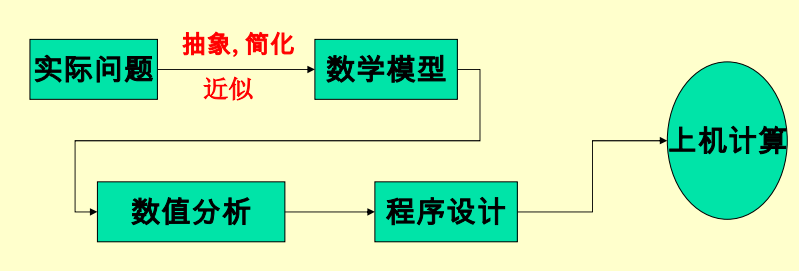

# 误差分析

## 误差的产生

根据人们用计算机解决科学与工程计算问题的过程，主要会产生以下几个方面的误差：

- 模型误差：数学模型是对实际问题的抽象、简化和近似,存在误差
- 截断误差：求近似解
- 观测误差：通过测量或实验得到模型中参数的值而产生的误差
- 舍入误差：机器字长有限
  

模型误差、 观测误差不是数值分析讨论的内容,计算方法主要研究截断误差和舍入误差在计算过程中的传播和对计算结果的影响,以提高计算的精度。

## 相关的概念

### 绝对误差

令$x$是精确值，$x^*$是它的一个近似值，则$\epsilon(x)=|x - x^*|$是$x^*$的绝对误差。

### 误差

$e = x^* - x$称为误差，是有量纲的，可正可负

### 误差限

绝对误差的一个上界$\eta$，满足$\epsilon(x)=|x - x^*|<\eta$，通常约定$\eta = 0.5 * 10^p$，p是符合条件的最小整数。

### 有效数字

若近似值$x^*$的绝对误差限为某一位上的半个单位，且该位直到第一位非零数字一共有$n$位，则称$x^*$精确到该位，或者说$x^*$有$n$位有效数字。
若记$x^* = \pm 0.a_1a_2a_3...a_n * 10 ^ m, a_1 \ne 0$，当$|x^* - x| < 0.5 * 10 ^ {m - l}$，则$x^*$有$l$位有效数字
Eg:用四舍五入法则取 x=4.26972的近似值。
取其前2位 $x_1^* =4.3$ 有效数字为$2$位,此时$|x^* - x|<= 0.5 * 10 ^{-1}$
取其前4位 $x_2^* =4.270$ 有效数字为$4$位,此时$|x^* - x|<= 0.5 * 10 ^{-3}$

### Summary

由有效数字和误差限的关系，我们可以给定有效数字求解误差限，也可以根据误差限推导有效数字位数，核心在于$x^* = \pm 0.a_1a_2a_3...a_n * 10 ^ m, a_1 \ne 0$，当$|x^* - x| < 0.5 * 10 ^ {m - l}$，则$x^*$有$l$位有效数字

### 相对误差

$e_r = \frac{e}{x} = \frac{x^* - x}{x}$为近似值$x^*$的相对误差
当$|e_r|$较小时，定义$e_r = \frac{e}{x^*} = \frac{x^* - x}{x^*}$。
我们把相对误差绝对值的上限成为相对误差限$\epsilon_r$
$|e_r| = |\frac{e}{x^*}| = |\frac{x^* - x}{x^*}| \le \frac{\eta}{|x^*|} = \epsilon_r$

### 有效数字&相对误差限

#### 定理1

设近似值$x^* = \pm 0.a_1a_2a_3...a_n * 10 ^ m, a_1 \ne 0$有$n$位有效数字，其相对误差限为$\frac{1}{2a_1} * 10 ^ {-n + 1}$

**Proving**:
$|x^*-x| \le 0.5 * 10 ^ {m - n}$
$|x^*|\ge a_1 * 10 ^ {m - 1}$
两式相除得证

#### 定理2

设近似值$x^* = \pm 0.a_1a_2a_3...a_n * 10 ^ m, a_1 \ne 0$的相对误差限为$\frac{1}{2a_1+2} * 10 ^ {-n + 1}$，则至少有$n$位有效数字。

**Proving**:
$|x^*|\le (a_1+1) * 10 ^ {m - 1}$
$|x^* - x| = \frac{|x^*-x|}{|x^*|}*|x^*|=0.5 * 10 ^ {m - n}$

### 误差传播

四则运算误差传播
$\eta(x^*\pm y^*) = \eta(x^*)\pm \eta(y^*)$
$\eta(x^*y^*) = |x^*|\eta(y^*) + |y^*|\eta(x^*)$
$\eta(\frac{x^*}{y^*}) \approx \frac{|x^*|\eta(y^*) + |y^*|\eta(x^*)}{|y^*|^2}$
函数运算误差传播（利用拉格朗日中值定理）
$\eta(y) = |f'(x^*)|\eta(x), |f'(x^*)|$称为放大因子或绝对条件数
$|e_r(y)|\approx |f'(x^*) * \frac{x^*}{f(x^*)}| * |e_r(x)|$
多元函数误差传播
$e(y) = y^* - y = \sum_{k=1}^n \frac{\partial f(x_1^*, x_2^*...x_n^*)}{\partial x_k^*}e(x_k)$
$e_r(y) = \frac{y^* - y}{y^*} \approx \sum_{k=1}^n \frac{\partial f(x_1^*, x_2^*...x_n^*)}{\partial x_k^*} \frac{x_k^*}{y^*}e_r(x_k)$

## Tips

- 避免相近数相减：有效数字可能减少
- 避免除数的绝对值远小于被除数的绝对值：根据除法误差传播，这样误差会被放大
- 避免大数吃小数：计算机运算会先指数对齐，这样一些很小的值会被舍入（机器字长不够）
- 减少运算次数，减少误差累计
- 选用稳定的算法，控制舍入误差的传播

## Homework

**T1**: 下列个数都是经过四舍五入后得到的近似数，指出他们时具有几位有效数字的近似值，并确定$x_1^* + x_2^* + x_3^*, x_1^*x_2^* x_3^*$的误差限。$x_1^* = 1.1021, x_2^*=0.031, x_3^*=385.6$

根据有效数字等定义，$x_1^*$有$5$位有效数字，$x_2^*$有$2$位有效数字，$x_3^*$有$4$位有效数字
将它们用科学计数法表示为$x_1^* = 0.11021 * 10 ^ 1$,$x_2^* = 0.31 * 10 ^ -1$,$x_3^* = 0.3856 * 10 ^ 3$
再根据有效数字与绝对误差限的关系，可以得出
$e(x_1^*) = |x_1^* - x_1| \le 0.5 * 10 ^ {1 - 5} = 0.5 * 10 ^ {-4}$
$e(x_2^*) =|x_2^* - x_2| \le 0.5 * 10 ^ {-1 - 2} = 0.5 * 10 ^ {-3}$
$e(x_3^*) =|x_3^* - x_3| \le 0.5 * 10 ^ {3 - 4} = 0.5 * 10 ^ {-1}$
再由有效数字和相对误差限的关系，可以计算出
$e_r(x_1^*) = \frac{|x_1^* - x_1|}{|x_1^*|} = \frac{1}{2} * 10^{1 - 5} = \frac{1}{2} * 10 ^ {-4}$
$e_r(x_2^*) = \frac{|x_2^* - x_2|}{|x_2^*|} = \frac{1}{2*3} * 10^{1 - 2} = \frac{1}{6} * 10 ^ {-1}$
$e_r(x_3^*) = \frac{|x_3^* - x_3|}{|x_3^*|} = \frac{1}{2 * 3} * 10^{1 - 4} = \frac{1}{6} * 10 ^ {-3}$
由绝对误差传播公式可知
$e(x_1^* + x_2^* + x_3^*) = e(x_1^*) + e(x_2^*) + e(x_3^*) = 0.05055$
$e(x_1^*x_2^* x_3^*) = x_1^*x_2^* e(x_3^*) + x_1^* x_3^*e(x_2^*) + x_2^* x_3^*e(x_1^*) \approx 0.2148$
由相对误差传播公式可得
$e_r(x_1^* + x_2^* + x_3^*) = \frac{x_1^*e_r(x_1^*) + x_2^*e_r(x_2^*) + x_3^*e_r(x_3^*)}{x_1^* + x_2^* + x_3^*} \approx 1.68 * 10 ^ {-4}$
$e_r(x_1^*x_2^* x_3^*) = e_r(x_1^*) + e_r(x_2^*) + e_r(x_3^*) \approx 0.0169$

**T2**:已知$a^*=1.1062,b^*=0.947$都是四舍五入之后得到的近似值，问$a^* + b^*,a^*b^*$各有几位有效数字？

首先判断出$a^*$有$5$位有效数字，$b^*$有$3$位有效数字
随即得出
$e(a^*) = \frac{1}{2} * 10 ^ {-4}, e_r(a^*) = \frac{1}{2} * 10 ^{1 - 5}=\frac{1}{2} * 10 ^{-4} $
$e(b^*) = \frac{1}{2} * 10 ^ {-3}, e_r(b^*) = \frac{1}{18} * 10 ^{1 - 3}=\frac{1}{18} * 10 ^{-2}$
再根据误差传播公式，得出二者的相对误差限
$e_r(a^* + b^*) = \frac{a^*e_r(a^*) + b^*e_r(b^*)}{a^* + b^*} = 0.283 * 10 ^{-3}$
$e_r(a^*b^*) = e_r(a^*) + e_r(b^*) = 0.606 * 10 ^{-3}$
再设$a^* + b^*$有$n$位有效数字，$a^*b^*$有$m$位有效数字
则有方程
$\frac{1}{4} * 10 ^ {1 - n} \ge 0.283 * 10 ^ {-3}$
$\frac{1}{2} * 10 ^ {1 - m} \ge 0.606 * 10 ^ {-3}$
解得
$n \le 3, m \le 3$
因此$a^* + b^*$有$3$位有效数字
因此$a^*b^*$ 有 $3$位有效数字

**T3**:求$x$，使得3.141和3.142作为$x$的近似值时候都有4位有效数字。

首先，根据有效数字和误差限的关系，可以得出绝对误差限为 $\frac{1}{2} * 10 ^ {-3}$，即
$|3.141 - x| \le \frac{1}{2} * 10 ^ {-3} -> x \in [3.1405, 3.1415]$
$|3.142 - x| \le \frac{1}{2} * 10 ^ {-3} -> x \in [3.1415, 3.1425]$
得出$x = 3.1415$

**T4**:计算球体的体积，要求其相对误差限为1%，问半径R的相对误差限是多少？

球体体积公式为$V = \frac{4}{3}\pi R^3$
根据函数的传播误差
$e_r(V) = |4 \pi R^2 \frac{R}{\frac{4}{3}\pi R^3} ||e_r(R)|=3|e_r(R)|$
得出$e_r(R)\approx 0.3 $%
